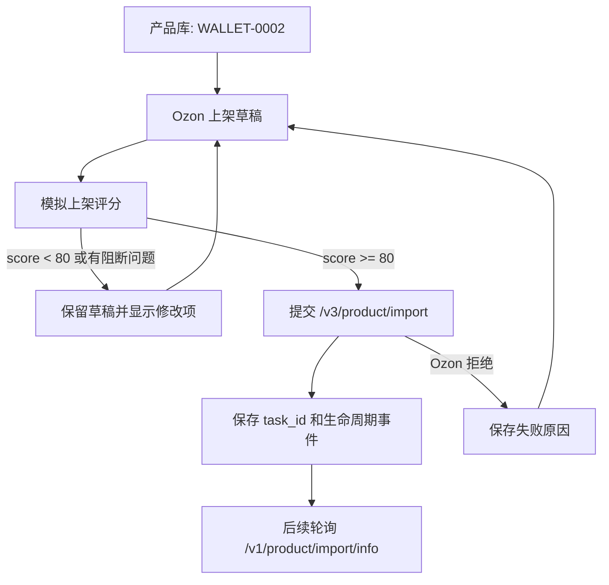

# Ozon API 上架生命周期

## 第一阶段目标

从店小秘页面填表切换为 sERP 自己管理 Ozon API 上架闭环。第一阶段只解决 wallet 类产品的创建与失败后再提交:

1. 生成 Ozon 上架草稿。
2. 模拟上架评分，目标分数不低于 80。
3. 达标后调用 `/v3/product/import` 提交。
4. Ozon 返回失败时保留草稿、错误、评分报告。
5. 用户修改草稿后再次提交；同一 `offer_id` 走 Ozon import 的 upsert 语义，作为增量更新基础。

首个测试产品: `WALLET-0002`，店铺: `ozon_anling`。

## API 生命周期

## 80 分评分规则

当前评分由后端 `/api/ozon/<store_id>/listing/simulate` 计算，不调用真实 Ozon 创建接口。

| 模块 | 分值 | 检查内容 |
|---|---:|---|
| 类目 | 15 | `description_category_id`、`type_id` |
| 基础信息 | 15 | 标题、描述、主 `offer_id`、售价 |
| 属性完整度 | 25 | 已填属性数量、材料、颜色、品牌、Rich Content |
| 媒体素材 | 20 | 可提交公网商品图，过滤 SVG、缩略图、图标、评论图 |
| 变体与库存 | 15 | SKU、价格、库存、SKU 唯一性 |
| 价格物流 | 10 | 售价、原价、重量、尺寸、条码 |

模拟评分低于 80，或存在阻断问题时，发布接口会拒绝提交，避免把明显不完整的商品送进 Ozon 审核。

## WALLET-0002 当前测试结果

用现有草稿数据模拟:

- 首次直接用草稿文件测试: 77 分，原因是草稿缺少 `sku_data`。
- 增加产品库 SKU 回退后: 92 分，可提交。
- 当前仍有非阻断提醒:
  - 缺少 Rich Content/JSON 富文本。
  - 图片列表中过滤了大量 Amazon 图标、缩略图、评论图。
  - 原价未能稳定识别。
  - 条码为空，后续需要接入 Ozon 条码生成或店铺策略。

## 已落地接口

| 接口 | 用途 |
|---|---|
| `POST /api/ozon/<store_id>/listing/simulate` | 模拟上架评分，不提交 Ozon |
| `POST /api/ozon/<store_id>/product/create` | 达到评分门槛后提交 `/v3/product/import` |

`product/create` 已改为质量门禁入口。提交成功后保留草稿并记录 `task_id`，不再删除草稿，这样失败后可以继续修改再提交。

## 官方依据

- Ozon API 上传商品说明: https://docs.ozon.com/global/zh-hans/api/via-api/
- Ozon API 使用说明: https://docs.ozon.com/global/zh-hans/api/intro/
- 商品导入状态检查: `POST /v1/product/import/info`

公开帮助文档仍提到通过商品导入接口提交后需要等待审核，状态用 `/v1/product/import/info` 查询；项目代码当前使用新版 `/v3/product/import`。后续更新官方 API 快照时，需要把旧知识库中的 `/v2/product/import` 描述和项目实际 `/v3/product/import` 差异单独标注。

## 下一步

1. 接入 `/v1/product/import/info` 轮询导入任务结果。
2. 把 Ozon 返回的失败原因翻译成字段级修改建议。
3. Rich Content 改为结构化生成和校验。
4. 图片进入自己的托管/上传链路，避免依赖 Amazon 原图 URL。
5. 对 wallet 类目的必填属性做官方属性清单缓存，评分从“通用规则”升级为“类目规则”。
