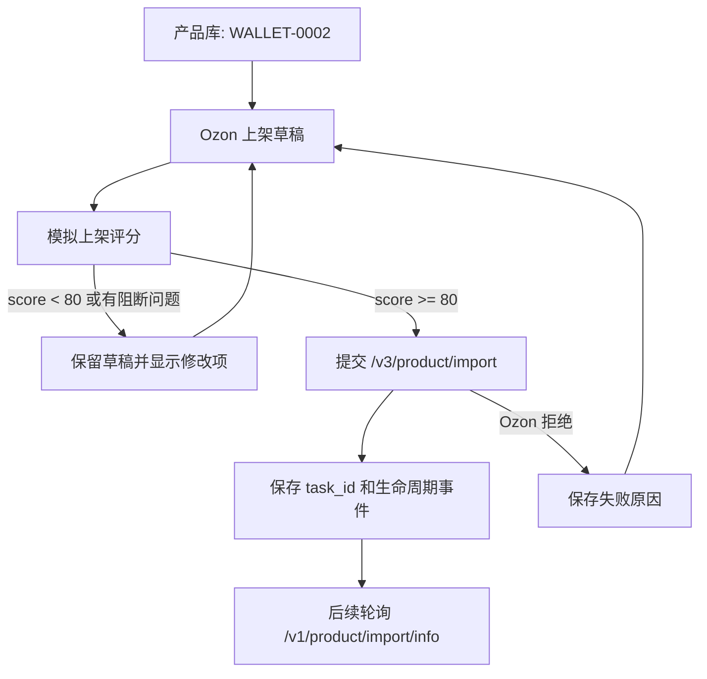

# Ozon API 上架生命周期

## 第一阶段目标

从店小秘页面填表切换为 sERP 自己管理 Ozon API 上架闭环。第一阶段只解决 wallet 类产品的创建与失败后再提交:

1. 生成 Ozon 上架草稿。
2. 模拟上架评分，目标分数不低于 80。
3. 达标后调用 `/v3/product/import` 提交。
4. Ozon 返回失败时保留草稿、错误、评分报告。
5. 用户修改草稿后再次提交；同一 `offer_id` 走 Ozon import 的 upsert 语义，作为增量更新基础。

首个测试产品: `WALLET-0002`，店铺: `ozon_anling`。

## API 生命周期

## 80 分评分规则

当前评分由后端 `/api/ozon/<store_id>/listing/simulate` 计算，不调用真实 Ozon 创建接口。

| 模块 | 分值 | 检查内容 |
|---|---:|---|
| 类目 | 15 | `description_category_id`、`type_id` |
| 基础信息 | 15 | 标题、描述、主 `offer_id`、售价 |
| 属性完整度 | 25 | 已填属性数量、材料、颜色、品牌、Rich Content |
| 媒体素材 | 20 | 可提交公网商品图，过滤 SVG、缩略图、图标、评论图 |
| 变体与库存 | 15 | SKU、价格、库存、SKU 唯一性 |
| 价格物流 | 10 | 售价、原价、重量、尺寸、条码 |

模拟评分低于 80，或存在阻断问题时，发布接口会拒绝提交，避免把明显不完整的商品送进 Ozon 审核。

## WALLET-0002 当前测试结果

用现有草稿数据模拟:

- 首次直接用草稿文件测试: 77 分，原因是草稿缺少 `sku_data`。
- 增加产品库 SKU 回退后: 92 分，可提交。
- 当前仍有非阻断提醒:
  - 缺少 Rich Content/JSON 富文本。
  - 图片列表中过滤了大量 Amazon 图标、缩略图、评论图。
  - 原价未能稳定识别。
  - 条码为空，后续需要接入 Ozon 条码生成或店铺策略。

## 已落地接口

| 接口 | 用途 |
|---|---|
| `POST /api/ozon/<store_id>/listing/simulate` | 模拟上架评分，不提交 Ozon |
| `POST /api/ozon/<store_id>/product/create` | 达到评分门槛后提交 `/v3/product/import` |

`product/create` 已改为质量门禁入口。提交成功后保留草稿并记录 `task_id`，不再删除草稿，这样失败后可以继续修改再提交。

## 官方依据

- Ozon API 上传商品说明: https://docs.ozon.com/global/zh-hans/api/via-api/
- Ozon API 使用说明: https://docs.ozon.com/global/zh-hans/api/intro/
- 商品导入状态检查: `POST /v1/product/import/info`

公开帮助文档仍提到通过商品导入接口提交后需要等待审核，状态用 `/v1/product/import/info` 查询；项目代码当前使用新版 `/v3/product/import`。后续更新官方 API 快照时，需要把旧知识库中的 `/v2/product/import` 描述和项目实际 `/v3/product/import` 差异单独标注。

## 下一步

1. 接入 `/v1/product/import/info` 轮询导入任务结果。
2. 把 Ozon 返回的失败原因翻译成字段级修改建议。
3. Rich Content 改为结构化生成和校验。
4. 图片进入自己的托管/上传链路，避免依赖 Amazon 原图 URL。
5. 对 wallet 类目的必填属性做官方属性清单缓存，评分从“通用规则”升级为“类目规则”。

## 2026-05-22 真实环境提交记录

店铺: `ozon_anling`
测试产品: `WALLET-0002`
提交接口: `POST /v3/product/import`
Ozon 任务 ID: `4525805426`

提交结果:

- Ozon 接收了 3 个变体，并返回了 `product_id`:
  - `WALLET-0002-BLACK` -> `4690462570`
  - `WALLET-0002-DUSTYPINK` -> `4690462523`
  - `WALLET-0002-ROSERED` -> `4690462633`
- `/v1/product/import/info` 返回每个变体 `status=imported`，但同时带有阻断错误，商品不能视为完成上架。

Ozon 返回的阻断项:

| 问题 | Ozon 字段 | 影响 | 下一步 |
|---|---|---|---|
| 品牌值不在字典中 | attribute `85` / `Бренд` | error | 已查到品牌字典值 `Bostanten`，`dictionary_value_id=971068372`，下一次增量更新必须用字典 ID |
| Rich Content JSON 不符合模板 | `RichContentJson` | error | 暂时不要把当前 `attribute_id=11254` 的 JSON 直接提交；需要按 Ozon rich-content sandbox 模板生成 |
| 缺少包装重量和尺寸 | `weight` / dimension fields | error | `/v3/product/import` item 层必须补 `weight`、`height`、`width`、`depth`，不能只放在类目属性里 |

Ozon 返回的警告项:

| 问题 | Ozon 字段 | 下一步 |
|---|---|---|
| 商品颜色不是字典值 | attribute `10096` / `Цвет товара` | 查询颜色属性字典，提交 `dictionary_value_id` |
| 目标受众不是字典值 | attribute `9390` / `Целевая аудитория` | 查询属性字典，提交女性对应的字典值 |
| 闭合方式不是字典值 | attribute `5344` / `Тип застежки` | 查询属性字典，提交拉链对应的字典值 |

结论:

- API 真实上架链路已经打通，Ozon 能接收 payload 并创建导入任务。
- 第一轮失败不是网络或凭证问题，而是字段格式问题：字典属性、Rich Content 模板、item 层重量尺寸。
- 下一步应做“失败原因 -> 自动修正 payload -> 同 offer_id 增量更新”的闭环，不再回到店小秘页面适配。

## DeepSeek 后续任务卡

目标: 继续用 `WALLET-0002` 在 `ozon_anling` 做真实 API 上架，直到 Ozon 官方商品卡质量分达到 80 分以上。

### 任务 1: 修复 Ozon import payload 生成

负责文件:

- `app.py`
- 必要时新增 `src/serp/ozon/` 下的轻量领域模块

必须完成:

1. `POST /api/ozon/<store_id>/product/create` 生成 item 时补齐 Ozon item 层尺寸重量字段:
   - `weight`: 使用实测重量，`WALLET-0002` 当前为 `200g`。
   - `depth` / `width` / `height`: 使用实测尺寸，没有实测时用采集尺寸。
   - 注意 Ozon 字段单位需要按官方文档确认，不能只写类目属性。
2. 字典属性不能再提交普通字符串。至少先修这几个:
   - 品牌 attribute `85`: `Bostanten`, `dictionary_value_id=971068372`
   - 商品颜色 attribute `10096`: 查询字典后按每个变体填对应值
   - 目标受众 attribute `9390`: 查询女性对应字典值
   - 闭合方式 attribute `5344`: 查询拉链对应字典值
3. Rich Content 暂时不要提交当前坏 JSON。
   - 短期方案: 移除 `attribute_id=11254`，先保证商品能过导入。
   - 后续方案: 按 https://rich-content.ozon.ru/sandbox 模板生成合法 JSON。

验收:

- 重新提交同一批 `offer_id`:
  - `WALLET-0002-BLACK`
  - `WALLET-0002-DUSTYPINK`
  - `WALLET-0002-ROSERED`
- `/v1/product/import/info` 不再出现:
  - `error_attribute_values_out_of_range` for `Бренд`
  - `invalid_rich_content_json`
  - `missing_dimension`

### 任务 2: 把失败原因结构化保存

负责文件:

- `app.py`
- `data/listings/WALLET-0002_ozon_anling.json` 只可作为本地测试产物，不要提交真实凭证

必须完成:

1. 新增或扩展接口查询 import task:
   - 输入: `task_id`
   - 调 Ozon `/v1/product/import/info`
   - 输出: 按 `offer_id` 分组的 errors/warnings
2. 把 Ozon 错误映射成中文修复建议:
   - error: 阻断上架
   - warning: 可上架但影响质量分
3. 保存到 listing draft 的 `lifecycle`，方便下一轮增量更新。

验收:

- 页面或接口能看到 `task_id=4525805426` 的历史错误摘要。
- 错误摘要必须能指导下一次 payload 修复。

### 任务 3: 接官方商品质量分

必须先查 Ozon 官方 API。

目标:

- 找到 Ozon 是否开放商品卡质量分/内容评级/quality score 接口。
- 如果有 API: 接入并保存官方分数。
- 如果没有 API: 标明“无公开 API”，临时从 Ozon 后台页面或导入错误近似判断，但文档里必须写清楚这不是官方分数。

验收:

- 不能再把 sERP 自定义 80 分当成 Ozon 官方分数。
- 文档中明确区分:
  - sERP 提交前质量门禁分
  - Ozon 官方商品卡质量分

### 执行顺序

1. 先做任务 1，让 WALLET-0002 能通过 Ozon import 的阻断错误。
2. 再做任务 2，把失败原因沉淀成生命周期数据。
3. 最后做任务 3，追 Ozon 官方 80 分目标。

### 注意事项

- 不要继续投入店小秘页面适配。
- 不要提交 `.env`、真实 API Key、临时 curl payload 文件。
- 每完成一个逻辑单元提交一次到 `ai/session`。
- 真实提交前必须确认当前 payload 不包含明显无关图片 URL、SVG、缩略图、评论图。
